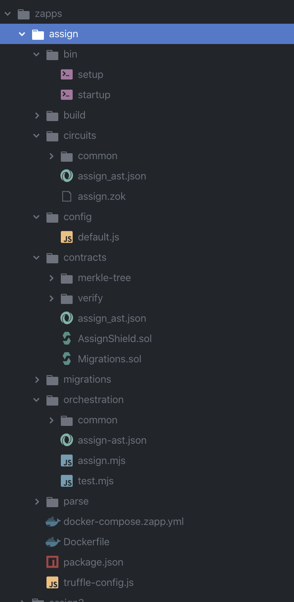
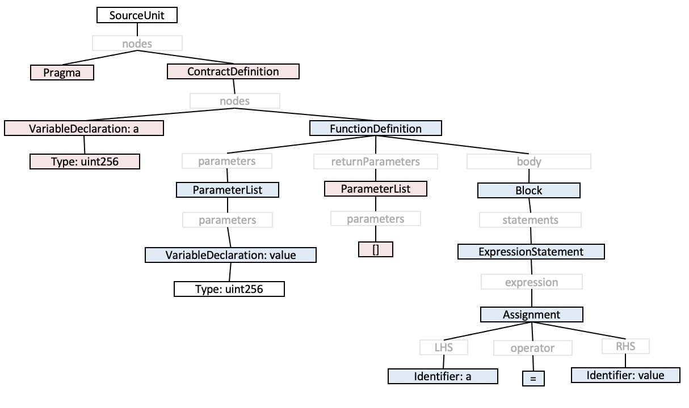
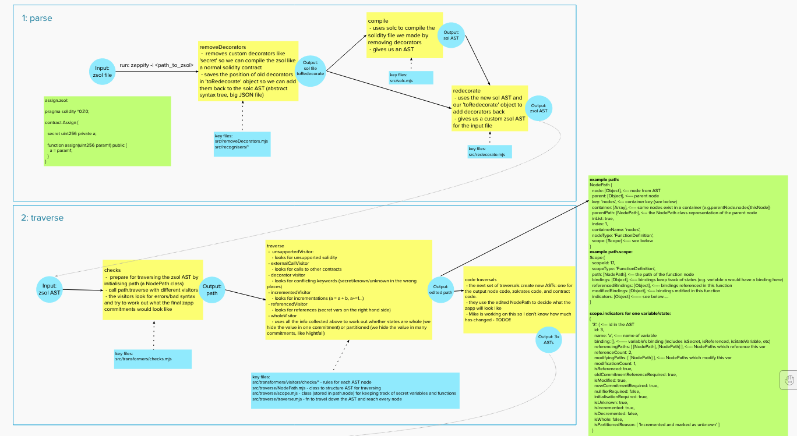

# starlight :stars:

_Generate a zApp from a Solidity contract._

This high-level document explains what the transpiler is, how it works, and how we came to make certain design decisions.

Please note this write-up may be out of date as more features are added and design decisions are being made.

**Authors:** Michael Connor, Miranda Wood

---

<!-- START doctoc generated TOC please keep comment here to allow auto update -->
<!-- DON'T EDIT THIS SECTION, INSTEAD RE-RUN doctoc TO UPDATE -->

- [Introduction](#introduction)
- [Overview](#overview)
- [Compiler architecture](#compiler-architecture)
  - [Summary](#summary)
  - [Parse](#parse)
  - [Transform](#transform)
    - [Traversals](#traversals)
      - [Node](#node)
      - [NodePath](#nodepath)
      - [Scope](#scope)
      - [Bindings](#bindings)
      - [Indicators](#indicators)
    - [Preliminary traversals](#preliminary-traversals)
  - [Code Generation](#code-generation)
- [Protocol](#protocol)
  - [Limitations](#limitations)
      - [Summary](#summary-1)
  - [Commitment structure](#commitment-structure)
    - [Summary](#summary-2)
    - [State variable IDs](#state-variable-ids)
    - [zApps' commitment structures](#zapps-commitment-structures)
      - [Commitment structure for structs](#commitment-structure-for-structs)
    - [To PK or not to PK](#to-pk-or-not-to-pk)
  - [Whole vs Partitioned states](#whole-vs-partitioned-states)
    - [Summary](#summary-3)
    - [Whole states](#whole-states)
    - [Partitioned states](#partitioned-states)
    - [Identification of whole/partitioned with (un)known](#identification-of-wholepartitioned-with-unknown)
    - [Initialisation of whole states](#initialisation-of-whole-states)
    - [Re-initialisation of whole states](#re-initialisation-of-whole-states)
    - [Examples](#examples)
  - [Ownership](#ownership)
  - [Accessing private states](#accessing-private-states)
    - [Summary](#summary-4)
  - [Key management](#key-management)

<!-- END doctoc generated TOC please keep comment here to allow auto update -->

---

## Introduction

zApps are zero-knowledge applications. They're like dApps (decentralised applications), but with privacy. zApps are tricky to write, but Solidity contracts are lovely to write. So why not try to write a zApp with Solidity? starlight helps developers do just this...

- Write a Solidity contract
- Add a few new privacy decorators to the contract (to get a 'Zolidity' contract)
- Run `zappify`
- Get a fully working zApp in return

_Solidity contract --> Zolidity contract --> zappify --> zApp_

---

## Overview

From the user's perspective, they write a 'normal' smart contract, like this one:

```solidity
// SPDX-License-Identifier: CC0

pragma solidity ^0.7.0;

contract Assign {

  uint256 private a;

  function assign(uint256 value) public {
    a = value;
  }
}
```

Then add decorators to tell the compiler which variables they want to keep secret:
```solidity
// SPDX-License-Identifier: CC0

pragma solidity ^0.7.0;

contract Assign {

  secret uint256 private a; // <--- secret

  function assign(secret uint256 value) public { // <--- secret
    a = value;
  }
}
```

They run `zappify -i <./path/to/file>.zol` and get an entire standalone zapp in return:



Easy!

---

## Compiler architecture

### Summary

To `zappify`, the compiler must take the Zolidity file (a `.zol` file) and complete the following (simplified) steps:
-   **parse**, takes the `zol` code, analyses it, and creates an abstract syntax tree (AST) representation of that code
-   **transform**, changes that AST into: a circuit AST, a smart contract AST, and an 'orchestration' AST.
-   **generate code**, generates code for the output zApp (circuit, contract and orchestration code)

\* *since we are taking already-working code and converting it into more working code of different language(s), this is technically a transpiler, not a compiler*

_[Skip](#what-we-done-did-so-far) to the next big section. Or read on for detailed explanations._

### Parse

At this stage, to transform the `.zol` file into an AST, we cheat a little. We actually first use `solc` to compile it as if it were a normal `.sol` file, to get a normal solidity AST. However, `solc` would throw a hundred errors at us if we kept the special decorators like `secret` in there.

So the parsing stage (unlike a 'normal' compiler) looks through the code line by line and identifies decorators. It removes those decorators, saving their place, to output a working `.sol` file. We can then use `solc compile` to get a nice, ready-made Solidity AST! [Here](./littleast.json)'s a (very abridged) version of what the AST for the above example looks like.

Graphically, that JSON AST translates to this:



The parsing stage has saved all the locations of special `zol` decorators for us. So the above `dedecoratedAST` can be `redecorated`. We turn a secret variable node from something like:
```json
{
    "id": 3,
    "mutability": "mutable",
    "name": "a",
    "nodeType": "VariableDeclaration",
    "stateVariable": true,
    "visibility": "private",
}
```
To:
```json
{
    "id": 3,
    "mutability": "mutable",
    "name": "a",
    "nodeType": "VariableDeclaration",
    "stateVariable": true,
    "visibility": "private",
    "isSecret": true, // <-- this
}
```
For each decorated variable, statement, parameter, and function. This output `zol` AST is then *traversed* and *transformed*.

### Transform

#### Traversals

We adopt some traversal nomenclature similar to the Babel transpiler. See this useful [Babel Handbook](https://github.com/jamiebuilds/babel-handbook/blob/master/translations/en/plugin-handbook.md#babel-plugin-handbook) resource.

##### Node

A node of an AST. A node will be of a particular `nodeType` and contains information bespoke to that nodeType. Each node contains information about its subNodes or child nodes, but not about its parent.

##### NodePath

A regular node doesn't contain information about its parents, and so when a traverser enters a particular node, it loses 'sight' of its location in the larger tree. What are this node's parents? Does it have siblings? Does it have an ancestor which is of nodeType 'FunctionDefinition'?

The `NodePath` class is designed to 'wrap' a node in lots of extra information about the node's location within the tree, and contains lots of methods to retrieve information about the tree around the node. A `NodePath` instance (often named `path`) gets created for each node of an AST.

##### Scope

The Babel Handbook explains this concept nicely. A scope is a section of code where a name binding is valid. A `Scope` class gets created for each `scopeType`: `ContractDefinition` scopes and `FunctionDefinition` scopes are the main ones we focus on for our purposes. Depending on the `scopeType`, different information will be collected. Several 'preliminary traversals' are done to collect information and add it to various scopes.

Consider the following example `.zol` code snippet. Scopes are highlighted.

```solidity
// Beginning of `SourceUnit` scopeType
// SPDX-License-Identifier: CC0

pragma solidity ^0.7.0;

contract Assign { // Beginning of `ContractDefinition` scopeType

    secret uint256 private a;

    function assign( // Beginning of `FunctionDefinition` scopeType
        secret uint256 value
    )
    public
    {
        a = value;

        {
            // Blocks of scope like this aren't yet supported.
        }
    } // End of `FunctionDefinition` scopeType
} // End of `ContractDefinition` scopeType
// End of `SourceUnit` scopeType
```

##### Bindings

A binding is the assigning of a name to a variable. In this codebase, a `binding` is an object that is created for each newly declared variable or function or contract within a scope. Each `binding` object is attached to the `scope.bindings` super object.

A `ContractDefinition` `binding` looks something like this:
```js
{
  kind: `ContractDefinition`,
  id: 1,
  name: 'MyContractName',
  node, // the `node` object of the `ContractDefinition` node being declared,
  path, // the `path` which wraps the `node`,
  scope, // the `scope` class instance representing the scope in which this `ContractDefinition` has been declared (probably of a `SourceUnit` scopeType),
};
```

A `FunctionDefinition` `binding` looks something like this:

```js
{
  kind: `FunctionDefinition`,
  id: 3,
  name: 'myFunctionName',
  node, // the `node` object of the `FunctionDefinition` node being declared,
  path, // the `path` which wraps the `node`,
  scope, // the `scope` class instance representing the scope in which this `FunctionDefinition` has been declared (probably of a `ContractDefinition` scopeType),
};
```

A `VariableDeclaration` `binding` looks something like this:

```js
{
  kind: `VariableDeclaration`, // TODO: make 'kind' more specific, e.g. 'param'?
  id: 16,
  name: 'myVarName',
  node,
  path,
  scope,
  stateVariable: true,
  isSecret: true,
  isReferenced: true,
  referenceCount: 2,
  referencingPaths: [<path>, <path>], // paths which reference this binding
  isModified: true,
  modificationCount: 1,
  modifyingPaths: [<path>], // paths which modify this binding
  isNullified: true,
  isKnown: true,
  isWhole: true,
  isPartitioned: false,
  isOwned: true,
  owner,
};
```

If the variable is a mapping, we additionally hold some of these fields in `binding.mappingKey[key]`. This is to separate out states like `myMapping[a]` and `myMapping[b]`, since they may have different properties.

```js
{
  kind: `VariableDeclaration`, // TODO: make 'kind' more specific, e.g. 'param'?
  id: 16,
  name: 'myVarName',
  node,
  path,
  scope,
  stateVariable: true,
  isSecret: true,
  isReferenced: true,
  referenceCount: 2,
  referencingPaths: [<path>, <path>], // paths which reference this binding
  isModified: true,
  modificationCount: 1,
  modifyingPaths: [<path>], // paths which modify this binding
  isNullified: true,
  isMapping: true,
  mappingKey: {
    a: {
      referencedKeyId: 51,
      referencedKeyNodeType: 'VariableDeclaration',
      referencedKeyIsParam: false,
      isMsgSender: false,
      isSecret: true,
      isReferenced: true,
      referenceCount: 1,
      referencingPaths: [Array],
      isModified: true,
      modificationCount: 1,
      modifyingPaths: [Array],
      nullifyingPaths: [Array],
      owner: [Object],
      isOwned: true
    },
    b: {
      referencedKeyId: 73,
      referencedKeyNodeType: 'VariableDeclaration',
      referencedKeyIsParam: false,
      isMsgSender: false,
      isSecret: true,
      isReferenced: true,
      referenceCount: 1,
      referencingPaths: [Array],
      isModified: false,
      modificationCount: 0,
      modifyingPaths: [Array],
      nullifyingPaths: []
    }
},
  isKnown: true,
  isWhole: true,
  isPartitioned: false,
  isOwned: true,
  owner,
};
```
##### Indicators

Not a Babel concept. We add objects called `indicators` to `scope` class instances and `path` class instances. Indicators are often booleans which describe certain zApp-related properties of state variables within a particular scopeType or within a particular nodeType. These indicators will be used by visitor functions in later traversals, when deciding how to build the new ASTs.

Indicators attached to a `ContractDefinition` `scopeType` inform the transformer visitors about whether to `import` various boilerplate modules of code:

| Indicator | what it indicates |
|:-|:--|
| `zkSnarkVerificationRequired` | whether to import zk-snark verification boilerplate |
| `oldCommitmentAccessRequired` | whether to import set membership boilerplate  |
| `nullifiersRequired` | whether to import nullifier calculation and/or set non-membership boilerplate |
| `newCommitmentsRequired` | whether to import commitment calculation boilerplate |

Indicators attached to a `FunctionDefinition` `scopeType` (not an exhaustive list of object properties) are actually assigned for each state variable mentioned in the function's scope:

For each stateVariable within the function, its indicator object is:

```js
{
  id: state_var_node_id
  name: state_var_name,
  binding: { binding_of_var_decl },
  isReferenced: true,
  referenceCount: 3,
  referencingPaths: [
    path_of_identifier,
    path_of_identifier,
    ...
  ], // we use an array to preserve the order of references
  isModified: true,
  modificationCount: 1,
  modifyingPaths: [
    path_of_identifier,
    path_of_identifier,
    ...
  ], // a subset of referencingPaths. // we use an array to preserve the order of references
  isNullified: true,
  nullifyingPaths: [
    path_of_identifier,
    path_of_identifier,
    ...
  ], // a subset of modifyingPaths. // we use an array to preserve the order of references
  isMapping: false,
  oldCommitmentAccessRequired: true
  initialisationRequired: true,
  newCommitmentRequired: true,
  isIncremented: false,
  isDecremented: false,
  isWhole: true,
  isPartitioned: false,
  isOwned: true,
  owner: { binding_of_owner_var_decl },
}
```

| Indicator | what it indicates |
|:-|:--|
| `isReferenced` | whether the stateVar is referenced (mentioned anywhere) within the function |
| `isModified` | whether the stateVar's value is modified within the function |
| `isAccessed` | whether the stateVar is accessed ('looked up') on the RHS of any assignment statements. Not to be confused with isReferenced. |
| `oldCommitmentAccessRequired` | whether to import set membership boilerplate for this stateVar within this function |
| `nullifiersRequired` | whether to import nullifier calculation and/or set non-membership boilerplate for this stateVar within this function |
| `newCommitmentRequired` | whether to import commitment calculation boilerplate for this stateVar within this function |
| `isIncremented` | whether the stateVar is incremented within the function |
| `isIncremented` | whether the stateVar is decremented within the function |
| `isWhole` | whether the stateVar is whole or partitioned |
| `isPartitioned` | whether the stateVar is whole or partitioned |
| `isOwned` | whether the stateVar has an owner we can deduce |
| `isMapping` | whether the stateVar is a mapping |

If `isMapping`, we again have a `mappingKey[key]` field for each key which appears in this function. This is so that, for example, the `modifyingPaths` for `myMapping[a]` are stored separately from the `modifyingPaths` for `myMapping[b]`.

We also have these indicators for stateVariables at the function scope level (such as `oldCommitmentAccessRequired` and `isNullified`), because secret states might need to be nullified in one function (e.g. Nightfall burn), but not another (e.g. Nightfall mint).

#### Preliminary traversals

We first look at every node in the custom `zol` AST and perform a series of traversals to collect all the information we need for our zApp. Which variables are secret? How many functions are there? What should our commitments look like? Which variables should be nullified? Has the user written something really stupid?

This step answers those questions, and more, with the magic of *traversals*. Each traversal takes us through the entire AST and stores information based on certain rules. In later 'transform' traversals, we gradually build up new ASTs which represent output zApp code by traversing the `zol` AST.

For now, lets look at the preliminary traversals, which check for errors, find secrets, and populate indicators.

A traversal is a [depth-first search](https://en.wikipedia.org/wiki/Depth-first_search) of the AST from the current `path` of the AST. Each traversal follows a [visitor pattern](https://en.wikipedia.org/wiki/Visitor_pattern). For each AST traversal, a particular visitor function is passed in. When a node of a particular nodeType is 'visited' by the traverser, the visitor function will perform a task specifically for that nodeType (e.g. "do this thing when we find a `VariableDeclaration` node"). The visitor functions primarily build objects. Preliminary visitors build `scope` and `indicator` objects, whilst an AST transformation visitor will build an `AST` object representing a module of code for a particular programming language.

Each traversal starts at the root node of the `zol` AST; always a node of nodeType `SourceUnit`. A `path` and `scope` are initialised for this `SourceUnit` node, and then the traversal begins; we call: `path.traverse(visitor)`.

Preliminary traversals will generate:
- a nesting of `NodePath` class instances to wrap every node in the AST (paths within paths within paths...);
- a nesting of `Scope` class instances (scopes within scopes within scopes...);
- indicator objects for each scope;
- indicators for certain nodeTypes.

All this data is stored in a `WeakMap` cache, for retrieval by future traversals.

Below is a flow guide up to this step!



### Code Generation

At the end of the 'Transform' step, there will be three ASTs: a circuit, contract and orchestration AST.

The `codeGenerator` modules traverse these ASTs and convert the AST nodes into working code of the AST's language. E.g.:

- zokrates `.zok` files are created from the circuit AST
- solidity `.sol` files are created from the contract AST
- javascript `.mjs` files, docker files, and other orchestration files are created from the orchestration AST

The code generator effectively just converts data in a node object into strings of text, which are then saved to various files in the output zApp folder.

---

## Protocol


### Limitations

We'll start with a high-level summary of limitations of private protocols. Some of them are obvious consequences of what it means for something to be 'secret'. Others are unintuitive limitations. These are not limitations caused by using the compiler; they're limitations of private smart contracts that our building of the compiler has unearthed.

Some of the terminology in this summary will only make sense after reading everything else in this doc.

##### Summary

- If someone doesn't know a secret state, they can only call functions which _increment_ it (and only if such incrementations are decorated as `unknown`).
- If a secret state is a 'partitioned' state, then it can _only_ be incremented or decremented. It's impossible to perform other binary/arithmetic operations on a partitioned state, even if you know (own) the secret.
- Complex computations can only be performed on a 'whole' state.
- A 'partitioned' state can only be decremented by its owner; not by anyone.
- A 'whole' state can only be edited by its owner.
- A whole state cannot be initialised, without revealing _which_ state variable has just been initialised. I.e. its `stateVarId` is revealed to the blockchain.
  - The only exception to this is if the `stateVarId` may be a randomly assigned uniqueId, and bears no 'meaning' for the protocol.
- Thereafter (after initialisation) proper privacy resumes.
- A non-constant secret state cannot be 'accessed' without revealing its nullifier to the blockchain.
- A public state cannot be edited with reference to a `secret` state, without leaking information about that secret state, or possibly leaking the secret value completely.
I.e. you can't include a secret state on the RHS of an assignment statement, if a public state is on the LHS. The public change in the LHS reveals the likely value of the secret RHS.

### Commitment structure

The crux of a zApp is to wrap ordinary Solidity state variables in commitments, to hide those variables' values. Here, we explore the contents of a commitment preimage.

#### Summary

- Each commitment contains a `stateVarId` field, which uniquely identifies a particular state within the context of the contract. These ids are derived similarly to Ethereum storage slots.
- TODO: when we eventually have a commitment tree which stores data for multiple private contracts, commitment preimages will need to contain a contract id (e.g. a contract address).
- Commitment preimages for 'basic' Solidity types have the structure:
`commitment = h(stateVarId, value, ownerPK, salt)`
- Commitment preimages for `mapping`s have the structure:
`commitment = h( h(stateVarId, key), value, ownerPK, salt)`
- All commitments contain an `ownerPK`, which is useful for nullification.

_[Skip](#whole-vs-partitioned-states) to the next big section. Or read on for detailed explanations._

#### State variable IDs

We need the preimage of a commitment to point to exactly one state variable of the original Solidity contract. To that end, it helps to explore how conventional Solidity designed storage layouts to avoid collisions of state variables.

If you like, have a skim-read of [this](https://docs.soliditylang.org/en/v0.6.8/internals/layout_in_storage.html) to remind yourself about Solidity storage layout, or read the rest of this section.

Solidity's storage layout has inspired the layout of commitment preimages. Jump ahead to the [next section](#zapps-commitment-structures) to see how.

Take the following incomplete (regular Solidity) contract. Let's look at how Solidity allocates storage slots:

```solidity
contract MyContract {

  struct S { uint128 a; uint128 b; uint c; }
  uint x; // <-- storage slot 0
  uint y; // <-- storage slot 1
  address myAddress; // <-- storage slot 2
  mapping(uint => uint) myMapping1; // <-- p = storage slot 3
  mapping(uint => uint) myMapping2; // <-- p = storage slot 4
  mapping(uint => mapping(uint => uint)) myNestedMapping; // <-- p = storage slot 5
  S s; // <-- storage slots 6-7
  uint[] myDynamicArray; // p = storage slot 8
  uint[2] myStaticArray; // <--- storage slots 9 - 10

  ...
}
```

Quickly, to explain the weird ones:

- For `myMapping1`, storage slot `3` is empty. As is storage slot `4` for `myMapping2`. These empty slots help avoid collisions between these mappings when looking up their data.
- The data for `myMapping1[k]` is at storage slot `keccak(k, p=3)` (where `,` is concatenation).
- The data for `myMapping2[k]` is at storage slot `keccak(k, p=4)`.
- `myNestedMapping` is trickier but follows the same rules. Slot `5` is empty. The data for `myNestedMapping[k][l]` is at storage slot `keccak(l, keccak(k, p=5))`
- `s` occupies just two storage slots, where `a` and `b` are squished into one 256-bit slot (because they're `uint128`s), and `c` occupies its own slot.
- For `myDynamicArray`, slot `8` contains the length of the array. The array's data starts at slot `keccak(p=8)` and occupies as many subsequent slots as the array's length.

For mappings in particular, notice the storage slot calculations are just fancy key-value lookups:

```solidity
myMapping[key] = value, is stored at storage slot `hash( key, id )`
  ^        ^                                              ^    ^
 name     key                                            key  id  
```

**We don't follow these rules (^^^) exactly, but we're inspired by them...** Loosely copying these rules gives us confidence that our commitment preimage layouts probably won't cause collisions. You'll see in the next section that we choose to swap the key and the id around, because we're not mental.

#### zApps' commitment structures

For our current phase of work, we support `uint256` and `address` basic types, `structs`, `arrays`, and `mapping` (including mappings to structs).

Consider this incomplete `.zol` contract:

```solidity
contract MyContract {
  secret uint256 x; // <-- AST id 2 (for example)
  secret uint256 y; // <-- AST id 3
  secret address myAddress; // <-- AST id 4
  secret mapping(uint256 => uint256) myMapping1; // <-- AST id 5
  secret mapping(uint256 => uint256) myMapping2; // <-- AST id 6
  ...
}
```

Each node in our AST has an id:
```json
{
    "id": 3,
    "mutability": "mutable",
    "name": "a",
    "nodeType": "VariableDeclaration",
    "stateVariable": true,
    "visibility": "private",
    "isSecret": true,
}
```
_Every other node that references this node has a field `referencedDeclaration: 3`. It's this `id` that we're using (for now) instead of proper storage slots._

We hide the value of basic secret states in commitments of structure:

```solidity
h(stateVarId, value, ownerPublicKey, salt)
```

We hide the value of a `mapping` (evaluated at some `key`) in commitments of structure:

```solidity
h(h( stateVarId, key ), value, ownerPublicKey, salt)
//       ^        ^
//      id       key    <-- switched order from solidity storage layouts
```

The `value` field refers to the value of the entire state if it is whole, or a part of the state owned by `ownerPublicKey` if it's partitioned (see [below](#whole-vs-partitioned-states)). The `salt` is a random integer chosen to prevent duplicates and to hide the contents of the commitment.


These commitments have nullifiers of structure:

```solidity
h(stateVarId, ownerSecretKey, salt)
```

_Why didn't we simply store the state's name in the commitment? Names may not be unique; a pesky developer might name a function and a variable `x`, or shadow-declare a variable. Such an approach is more complicated._

##### Commitment structure for structs

When a secret state is a struct, the commitment preimage includes each property of the struct as a separate input to the commitment. For example, for a struct:

```solidity
struct S {
    uint256 a;
    address b;
    uint256 c;
}
```

the commitment for a secret state `S s` would be:

```solidity
h(stateVarId, s.a, s.b, s.c, ownerPublicKey, salt)
```

#### To PK or not to PK

We spent a lot of time thinking about whether to *always* include an owner public key (`ownerPK`) in the commitment, or *sometimes*, or *never*.
-   **Always**:
e.g. `commitment = h(stateVarId, value, ownerPK, salt)`
Ensures a nice uniform commitment structure for every state and forces us/the dev to think about who the secret is secret to. However, this means more hashing and having to infer who the owner of a state is with code, which may not be right.
-   **Sometimes**: We can add a public key whenever it is needed and save on hashing and complexity when it's not, but lose the uniform commitment structure.
-   **Never**:
e.g. e.g. `commitment = h(stateVarId, value, salt)`
Less hashing and complexity everywhere, and introduces the rule of 'you know the salt, so you are the owner'. This has a few complicated problems (discussed below).

_Spoiler alert: we've chosen to always have an `ownerPK` field in every commitment._

Even considering never having a PK in the commitment might seem silly. But it's not that silly. In many examples we discovered that if the secret state is tied to some identity, then the PK naturally turns up in the commitment as a mapping key anyway.

Take this example:

```solidity
secret mapping(address => uint256) balances;
// ...
balances[msg.sender] += value;
```

This secret mapping would have commitments (if we weren't including a PK by default) of the form:

```py
h( h(balancesStateVarID, key = ownerPK), value, salt)
```

The transpiler would convert an Ethereum address (the mapping key  (`msg.sender` in this case)) to a snark-compatible `ownerPK` anyway. We'd need a PoKoSK ("proof of knowledge of secret key") whenever we see `msg.sender` because a Zokrates circuit doesn't have a concept of 'owning' an address - so proving that you are `msg.sender` (which happens in the background of calling a contract) becomes proving that you own the secret key corresponding to whatever public key is in the commitment.

In short: whenever we see `msg.sender` in the `.zol` contract, we probably need a PoKoSK in the circuit. 'Probably' becomes 'definitely' if that code block deals with secret states.

That observation lead to the question: if we need a PK in the commitment, would they be added as a mapping key *anyway*? So do we need to bother with a separate PK field?

For example, if we had a separate PK in the above example, the commitment's structure would be:

```py
h( h(balancesStateVarID, key = ownerPK), value, ownerPK, salt)
```
... which is potentially an unnecessary duplication of `ownerPK` information.

Another example:

```solidity
secret mapping(uint256 => uint256) myMapping;

fn1(value1, value2) {
  (known) myMapping[value1] = value2;
}
```

Since we are overwriting a value (the value of `myMapping[value1]`), we need to nullify a previous commitment to call `fn1`. So, the user would need to provide the correct salt to the circuit to update `mymapping[value1]`, which does the same job as a PK would.

If the `.zol` developer wanted to restrict who can edit this state, they would add:
```solidity
require(msg.sender == someAddress);
```
Which would translate to a PoKoSK in the circuit, again doing the same job as a PK in the commitment. In the example of a Nightfall-like zApp, the owner's PK would be added to the mapping key field, and would not be needed.

However, there is one key problem with never having a PK in the commitment - transferring of ownership. With Nightfall, the mapping key would be changed to the receiver's address, so the PoKoSK in the circuit would change accordingly - great! What about other secrets?

Let's say we have a secret state `a` which is represented by a commitment `h(aVarId, value, salt)`. The dev wants a user of the zApp to be able to transfer ownership (i.e. nullification rights) to an other user. That's fine - and a good use of the zApp - so we should allow it. With the 'no PK in the commitment' rule, ownership is transferred by messaging the new user the salt. This seems ok, because this is how Nightfall's token transfer happens, but the previous owner *still knows the preimage to the nullifier*, meaning they can nullify it at any time, including after transferring ownership. Even if they don't, they still know when the new owner nullifies the commitment.

*Never* adding a public key to the commitment means that the 'owner' of a secret owns it forever. This removes nice transferability from any secret state (which doesn't include a key in its commitment as a mapping key), and there are plenty of states like that which (reasonably) should be transferable.

Adding a public key *sometimes* solves this. It does mean that the compiler needs to detect when:
-   There is no PoKoSK for a `msg.sender` check
-   There is no address mapping key which restricts state editors*

\*Looking for any address as a mapping key isn't enough here - there could be a zApp which secretly stores customer information by their address, but is editable by (and owned by) a system admin.

*Sometimes* also means that commitment structures are not uniform, which could be confusing to a Solidity dev who isn't familiar with zkp. Plus, it implies that some secrets are owned and some are not - which is even more confusing, because a secret has to be secret to *someone*, or it's not secret! If we don't specify that someone, then the secret state is nullifiable by anyone who knows the salt, which could be a long list of previous owners.

This is a long explanation of why we eventually went with *always*. We infer ownership by looking for who can initialise and nullify the state (discussed [below](#ownership)).

---

### Whole vs Partitioned states

#### Summary

Secret states are either *whole* or *partitioned*.

**Whole states:**
- A 'whole' state's secret value is contained within one commitment.
- Whenever a 'whole' state is edited, its one commitment gets nullified, and one replacement commitment is submitted.
- If a secret state is operated on in such a way that would require knowledge of the _entire_ state, it _must_ be a whole state.
E.g. `a = b` implies `a` must be whole.
E.g. `a *= b` implies `a` must be whole.
- A 'whole' state _cannot_ be decorated with `unknown` (and must throw an error in this case). A whole state is `known` by definition, since it can only be edited by its owner (who clearly must 'know' its secret).
- A secret state which is only ever incremented/decremented may be a 'whole' state, but only if its state changes are _nowhere_ preceded with the `unknown` decorator.

**Partitioned states:**
- A 'partitioned' state's value is split into one or many 'parts', with each part being contained in its own commitment. I.e. the state is 'partitioned' across multiple commitments.
- A secret state which is only ever incremented/decremented may be a 'partitioned' state, but only if at least one of its state changes is preceded with the `unknown` decorator.
- Only _incrementation_ statements (`a = a + b`, `a += b`, `a++`, `++a`) may be preceded with the `unknown` decorator.
- A _decrementation_ statement (`a = a - b`, `a -= b`, `a--`, `--a`) _cannot_ be decorated as `unknown`, because to decrement a state is to nullify some/all of its 'part' commitments. And to nullify is to be the owner (who clearly must `know` the secret).
- For partitioned states, the `known` decorator is optional for incrementing statements: you may omit `known` and the transpiler will treat the statement as if it were decorated with `known`. However, if you wish to use the `unknown` decorator, it must be specified explicitly. Incrementations without a decorator are treated as `known` by default.

_If this summary didn't make much sense, or if you'd like some meaty explanation for how/why we derived these rules, please read the rest of this section._

_[Skip](#ownership) to the next big section. Or read on for detailed explanations._

#### Whole states

A whole state is so-called because the entire state's secret value can be wrapped in a single commitment. I.e. a single commitment represents the 'whole' secret state.

A secret state _must_ be identified as 'whole' if, somewhere within the contract, it is operated on in such a way that would "require knowledge of the _entire_ state".

E.g. for a secret state `a`:

- If a function included an 'overwrite' `a = b`, there's no way someone could replace `a` without first knowing the _entire_ state of `a`.
- If a function included one of the arithmetic/binary operations `a *= b`, `a /= b`, `a %= b`, `a = a << b`, `a = a >> b` there's no way someone could compute these operations without first knowing the _entire_ state of `a`.

Two things:

- In order for a function caller to "demonstrate knowledge of the _entirety_ of a secret state", they _must_ be the owner. (Because how else would the know the current secret?).

- In order for a function caller to "demonstrate knowledge of the _entirety_ of a secret state", that state _must_ be whole.

Why whole? Well, we haven't covered the alternative of 'partitioned' states yet, but feels like the best place to tackle this question...

Let's argue why a secret state _cannot_ be a 'partitioned state' if (somewhere within the contract) it is operated on in such a way that would "require knowledge of the _entire_ state". It's simply because it's impossible to reliably ['access'](#accessing-private-states) (refer to) the _entirety_ of a _partitioned_ state. Why? Well, if a secret state is partitioned across lots of commitments, then in order to refer to its total value, the state's owner must collect all parts of that partitioned state and 'sum' them. But how can the owner convince a smart contract that he has reliably summed _all_ parts, and hasn't omitted one? He can't. There's no way to prove that the 'accessed' value comprises the entire partition of 'parts', without unwrapping all commitments in the commitment tree - which is impossible to do, because they're mostly owned by other people.

What kind of operations _don't_ require knowledge of the entire state?

Incrementations and decrementations. A user can increment a state without accessing its entire value. Similarly, a state can be decremented without accessing its entire value, as long as a collection of parts _at least_ as large as the [minuend](https://www.google.com/search?hl=en&q=minuend&oq=minuend) can be collected and proven to exist.


#### Partitioned states

A 'whole' state can only be edited by the 'owner' of such a state. If the only way of modifying a secret state was to be its 'owner', we'd be severely limited in the kinds of contracts we could write.

A 'partitioned' state, on the other hand, can be edited (incremented*) by a user who doesn't own or know its secret value. Partitioned states are so-called, because the secret state gets split into little incremental chunks or 'parts', and each part is wrapped in its own commitment.

An example of this is lots of users contributing to a charity pot, where nobody needs to know how much money is in the pot to add to it.

```solidity
secret uint256 pot;
address admin;

function add(secret uint256 value) {
  unknown pot = pot + value; // don't worry about 'unknown', for now.
}

function withdraw(secret uint256 value) {
  require(msg.sender === admin);
  pot = pot - value;
}
```

Imagine if `pot` were a 'whole' state. Then its value would be wrapped in a single commitment:

```py
commitment_pot = h(id_pot, pot, ownerPK, salt)
```

Since only one commitment can exist for a 'whole' state at any one time, only the 'owner' of `pot` would ever be able to edit it, and so only the owner of `pot` would be able to call the `add` function. A developer might not want this; they might want _anyone_ to be able to call `add` to add money to the `pot`.

So suppose instead of wrapping the value of `pot` entirely in a single commitment, we allow it to be split into parts across multiple commitments. Then anyone would be able to call `add` and create a 'part' of the `pot`, without necessarily knowing the total value of the `pot`.

E.g. three independent people could call `add` to add different values to `pot`, creating three 'part' commitments of a 'partitioned' state:

- `commitments_pot[0] = h(id_pot, value0, ownerPK, salt0)`
- `commitments_pot[1] = h(id_pot, value1, ownerPK, salt1)`
- `commitments_pot[2] = h(id_pot, value2, ownerPK, salt2)`

These three commitments all point to the same secret state variable id, and are all owned by the 'owner' of the secret state. Collectively, they represent a total value for the `pot` of `value0 + value1 + value2`. None of the three people who called `add` would know the total value for the `pot`, so it would remain secret from them. The owner of the `pot` _would_ know all 'parts' of this 'partitioned' state, because the parts' values would have been [shared](#sharing-private-data) with them.

In summary, a partitioned state will have many commitments of the form `h(stateVarId, value, ownerPK, salt)` where all the `value`s add up to the state's total value.

In the above example, only the `admin` can remove money from the `pot`, so theirs is the PK we add to the commitment (more on this in the [ownership section](#ownership)). The `admin` removes money by providing a nullifier/nullifiers in `withdraw`.

\*Notice that the type of 'edit' in the above example is an 'incrementation'. It turns out incrementations (`a = a + something`, `a += something`, `a++`, `++a`) are the _only_ operations that a third party can actually perform on a secret state, given that they don't _know_ the state's entire value. And such incrementations are only possible if the state is 'partitioned' (not 'whole').

You could argue that a decrementation `a -= b` could be applied by someone not privy to to `a`, by creating a _negative_ 'part' for `a` equal to `-b`; but negative values lead to lots of complications.

A slight bit of ambiguity has crept in. In the above example, how can the transpiler reliably infer that we (the dev) want the secret value `pot` to be incrementable by _anyone_, rather than just the _owner_ of the state? It's actually not possible without some extra syntax (see the next subsection).

This is where the `unknown` decorator comes in. In the above example, the prepending of the `unknown` keyword to the state-change line `pot = pot + value` allows the transpiler to unambiguously infer that we want `pot` to be incrementable by third parties who don't necessarily _know_ the `pot` secret state (i.e. the state being edited is `unknown`). The transpiler therefore understands that it must split each incrementation of `pot` into its own 'part' commitment. `unknown` also signifies that the caller of `add()` doesn't have to demonstrate knowledge of the value of `pot`, and so doesn't have to provide a nullifier.

#### Identification of whole/partitioned with (un)known

The new decorators introduced here are `known` and `unknown`. While we wanted the compiler's `zol` code to be as close to normal Solidity as possible, we needed a way for the dev to tell the transpiler whether the state should be whole or partitioned.

Consider this example:
```solidity
secret uint256 a;

function fn1(secret uint256 value) {
  a = a + value;
}
```

The dev writing this `.zol` could feasibly want either of these:
1. _"`fn1()` should only be callable by the person who knows `a`, meaning only the owner* of `a` may edit `a`"_
1.  _"`fn1()` should be callable by anyone, meaning anyone may edit `a`"_.

To distinguish between these two cases, the `known`/`unknown` decorators refer to whether the caller _knows_ the value of the secret state being edited on a particular line.

What does the transpiler _do_ with these decorators?

- `unknown`
  - The state must be partitioned.
  - The caller of any function which includes an `unknown` decorator needn't provide knowledge of the preimage of any 'part' of the state (because they don't 'know' it).
- `known`
  - The state may or may not be whole/partitioned.
    - If the state is decorated as `unknown` elsewhere, then it's partitioned; otherwise, it's simplest to treat it as whole.
  - The caller of any function which includes a `known` decorator must provide proof of knowledge of the preimage of the commitment (if whole) or proof of knowledge of the preimages of _some_ 'part' commitments (if partitioned).

These `known`/`unknown` decorators are only required before 'incrementing statements' (`a = a + b`, `a += b`, `a++`, `++a`), because an 'incrementation' is the only type of operation which can be performed by someone who doesn't _know_ or _own_ the _entire_ state. (See earlier explanations in the 'whole' and 'partitioned' sections).

\*You might argue that the _owner_ of a secret state `a` might not be the _only_ person who _knows_ the secret `a`. For example, in a private transaction protocol, a 'sender' will create a commitment for a 'recipient'. So two parties would actually 'know' the secret (the contents of the preimage), whilst only one party (the recipient) would 'own' the secret (i.e. be able to nullify it).

You might then argue that the word `known` is therefore misleading, if the eventual protocol which is created enforces the caller to provide proof of _ownership_, which is a stronger requirement than proof of _knowledge_. However, if the protocol were to enforce the weaker requirement that the caller need only provide proof of _knowledge_ of the secret, the caller would also need to provide proof of the 'currency' of the secret; that it hasn't already been nullified. And to provide proof that something hasn't been nullified, requires knowledge of the nullifier in order to show non-inclusion in the nullifier set. And so we find that one cannot provide a weaker proof of _knowledge_ of a secret, without actually being the _owner_ of the secret. And so to decorate a state change as `known` has unambiguous consequences.

Having said that, if a secret state is `constant` (meaning it cannot be edited / nullified), then there _is_ a distinction between a proof of knowledge and a proof of ownership. But in such a case, it's unlikely for the constant secret to be known by more than one party.


#### Initialisation of whole states

What do we mean by 'initialisation'? Initialisation of a particular secret state is the submission of its very first commitment, which hides its initial value.

Initialisation of 'whole' states is a difficult topic. It's worth highlighting that initialisation of 'partitioned' states is not nearly as tricky. And if you're coming from a background in ZCash or Nightfall, you'll only be familiar with partitioned states. In fact, you'll have only ever dealt with a lovely edge-case of partitioned states, which can be initialised easily. We'll talk about initialisation of partitioned states later. In this section, we're fully focussed on initialising _whole_ states.


To start, consider this (very simple) example:

```solidity
contract Assign {

  secret uint256 private a;

  function assign(secret uint256 value) public {
    a = value;
  }
}
```

In normal Solidity land, `a` is implicitly initialised as `0`. Anyone could come along and call `assign()` and change the value of `a` to whatever they want. It would be a mental free for all, where `a` is one value for however-many minutes until the next person comes along and changes it. Nevertheless it is valid Solidity that a dev might write, and it should (and does) compile.

In zkp land, where `a` is secret, it's trickier. It wasn't immediately clear to us (as transpiler designers) whether `a` should get automatically initialised with an initial value, or even how that could be done. What should the initial value be? Who would the initial commitment be owned by? How would that initial commitment be submitted? How would the secret state be edited thereafter? Who would be allowed to edit it thereafter?

---

The Solidity above suggests _anyone_ should be able to come along and edit `a`, because the function doesn't impose any restrictions on the caller. But it's trickier to 'allow' this kind of code (again, as transpiler designers) when dealing with secret states. A 'secret' is a concept that implies a secret _owner_. So once a (whole) secret state has been initialised (with an owner), it feels natural that only the owner of that state should ever be allowed to change it in future. And indeed, that's something we decided in the earlier section on [whole states](#whole-states). Surely, some other person shouldn't be able to overwrite `a`, because our earlier discussions on whole states (and experience in zk protocols) tell us that you must produce a nullifier to overwrite a whole state.

We arrive at quite a difficult dilemma: either we can support this function as the dev clearly intended (a chaotic "free for all" in this example); or we can respect our intuition for how 'whole' secrets should be edited; only by the owner.

It turns out that the first option - of enabling a contract with 'special' whole states which may be nullified by anyone - isn't _possible_ if we wish to retain zero-knowledge. Why?

In order for the compiler to support "free for all" edits - like the above example, where anyone can nullify a whole state (if a clear owner of the state can't be inferred from other functions) - by changing the _structure_ of such states' nullifiers to something wich can be derived by _anyone_. With such a nullifier structure, _anyone_ would be able to come along and _replace_ someone else's secret `a` with a their own new secret for `a` (in line with the intentions of the developer's code). But in order for such a theoretical nullifier to nullify the original owner's commitment (and _only_ that commitment), the nullifier will need to be _linked_ to the original commitment in some way. But to that would mean the person nullifying would need to know unique, identifying details about the preimage of the commitment, and this would violate zero-knowledge. Furthermore, if _anyone_ is able to come along and nullify a particular commitment, then the unique nullifier for that commitment _must_ be derivable by anyone. And therefore when the nullifier gets submitted, everyone will know what it represents and what is being nullified! These are pretty convincing arguments to suggest that:
- **The above example must not compile, because its intentions contradict zero-knowledge protocols.**

It's an interesting discovery. We've found that not all developers' intentions are translatable into a zk protocol.

It leads us to a transpilation rule:

- **The transpiler must enforce that whole states must have a clearly inferrable owner, and can only be nullified by that owner.**
- **O.e. In order to edit a 'whole' secret state, you _must_ be able to produce a nullifier for it, as its _owner_.**


Notice that we didn't mention 'partitioned' states in that decision. Incrementation of a partitioned state (by design) does not require a nullifier. **For _decrementation_ of a partitioned state, however, we reach a similar conclusion to the above - that in order to decrement a partitioned state, you _must_ be able to produce a nullifier for it, as its owner.**

---

Let's continue discussing the problems around 'initialisation' of whole states.

We can continue with the example above as a starting point.

Suppose Alice comes along and creates the very first commitment in the commitment tree, representing `a`:

- `commitment_0 = h(id_a, value_a_0, alicePK, salt)` (where we'll be lazy with `salt` notation, and assume each new commitment will contain a different random `salt`).

Alice was the first to come along and create the commitment, and so she is now the owner of the secret state `a`. We'll question later whether the consequence of there being a 'race' to be the 'first' to initialise a secret state (to become its owner) is sensible. But for now, let's keep going.

Suppose, some time later, Bob sees this contract's code, and decides "That's a nice contract, I want to be the owner of the secret state `a`". Thanks for your interest, Bob.

Bob can pass his own inputs through the zApp's circuit to create a rival commitment representing the secret state `a`:

- `commitment_1 = h(id_a, value_a_1, bobPK, salt)`

... and he can submit this rival commitment to the shield contract.

Clearly, we don't want this to be possible; a secret state should only be initialisable once, and two rival commitments both pointing to the same `stateVarId` would be bad.

The solution, of course, is to enforce that a _nullifier_ be submitted in order for a commitment (for a particular stateVarId) to be replaced with a new one. Bob won't be able to derive a nullifier for Alice's `commitment_0` (because he doesn't know Alice's secret key nor her salt), and so he won't be able to submit a replacement commitment for `a`.

But how would the shield contract know that a commitment for `a` already exists in the commitment tree, when commitments hide what it is they represent?

In fact, if we rewind to when Alice submitted her `commitment_0` for `a` to the shield contract. How would the shield contract have known Alice's was the _first_ commitment for `a` to ever have been submitted? Or, to put it another way, **how would the shield contract have known to _not_ ask Alice for a nullifier?**

Well, it wouldn't know! There's no way for a shield contract to determine whether a commitment being submitted is the _first_ commitment to represent a particular secret state variable, because the shield contract doesn't know what any commitment represents. **And so there's no way for the shield contract to determine when or when not a nullifier should be submitted.**

---

Why?

You could argue that if the tree is _empty_, the shield contract knows that an initial commitment for `a` hasn't yet been submitted (because _no_ commitments have been submitted). But such an emptiness check doesn't scale if there are **multiple whole states** in a contract which need to be initialised (because the tree can only be empty once; thereafter it's unclear which states have or haven't been initialised, because commitments _hide_ that info). And such an emptiness check certainly won't scale when we move towards multiple private contracts all sharing the same commitment tree.

You also might try to architect it so that the initialisation of a state variable's commitment is done in a separate function from the replacement of its commitments thereafter, and so the shield contract would know whether the state is being initialised from the function's signature (or the verification key being used to verify the proof). But our working example for this section is a single function. It's reasonable for a dev to want a single function which initialises on the first call, and edits thereafter.

You might argue that applications like Nightfall do this by separating initialisation of a state through 'Mint' from changes thereafter through 'Transfer'. But that's not what happens. Nightfall's states are 'partitioned' (not 'whole'), and partitioned states are implicitly initialised as `0`. Users never actively "initialise" partitioned states; they only increment or decrement the already-initialised state. Mint and transfer are both **'state update'** functions; 'mint' is not a state initialisation function.

_Aside: in some cases, we may want the same state to be initialised more than once. This is an edge case where a state owner rescinds ownership of the state, and at some point later a different owner 'picks up' where they left off. This is discussed in the [next section](#re-initialisation-of-whole-states)._

Back to whole states...

You might argue that a 'preventifier' could be submitted at the time of first initialising a secret state. A 'preventifier' is something uniquely derivable from a stateVarId, which would get submitted at the time of first initialising a secret state. If future transactions try to initialise a duplicate commitment for the same state, they'd be forced to submit a duplicate of the preventifier, and the smart contract would reject the transaction. Clearly, a preventifier can be derived by anyone, and so all observers of the blockchain would learn exactly **what stateVarId just got initialised**. That's not good for zero knowledge.

Furthermore, adding an extra field to be submitted alongside the 'staple' private tx ingredients of "commitments, nullifiers, and a historic commitment root" isn't great if we keep an eye on the future; where we'll wish to hide the function being executed. Some functions having "preventifiers" and some not would **reduce the hiding of a function significantly**.

---

By now, we should be broadly convinced that the shield contract **cannot** distinguish between the initialisation of a whole state's commitment and the replacment of a state's commitment (because it cannot see what's inside a commitment), and therefore it cannot determine when or when not to demand a nullifier from the transactor.

It follows, that every transaction which edits a whole state must _always_ submit a nullifier for that state. If a shield contract is incapable of determining when a transaction is an attempt at initialisation, it will have to treat that transaction like any other and demand a nullifier.

But since there is no 'prior' commitment to nullify when initialising a whole state, there's no 'commitment preimage' from which we can derive a nullifier. We need to derive a 'dummy nullifier' somehow.

**"Initialisation of a whole state requires a dummy nullifier. Otherwise, any two people could submit two rival 'first' commitments, creating two versions of the secret state. We don't have this problem with partitioned states, because there, it's okay for many different commitments to represent one state."**

Our nice, uniform commitment structure, `h(stateVarId, value, ownerPublicKey, salt)`, has a correspinding nullifier structure `h(stateVarId, ownerSecretKey, salt)`.

But if our dummy nullifiers were to use this structure, we would again have the "rival first commitments" problem - any two users could initialise rival commitments for `a` with this structure, and both would be able to derive different, but equally-valid nullifiers which correctly correspond to their commitments. The shield contract would allow both submissions, because both would correctly prove ownership of their public key, preimage of their new commitment, and that their nullifier doesn't already exist.

So, it looks like we can't have a 'normal' nullifier for initialisation.

We came up with three options to this "dummy nullifier" problem:

1. A deterministic dummy nullifier which can only be submitted once:
`h(stateVarId, secretKey = 0, salt = 0)`
1. The 'Zexe approach', using a randomly generated state variable ID:
`h(randomId, ownerSecretKey, salt)`
1. The contract deployer (or some contract admin) will initialise the state:
`h(adminSecretKey, salt)`

_Spoiler alert: we've chosen option 1. [Skip](#re-initialisation-of-whole-states) our reasoning if you like._

**1)**

We adopt a new convention for the structure of a "deterministic dummy nullifier". Inside the circuit we enforce that a dummy nullifier is of the form `h(stateVarId, ownerSecretKey = 0, salt = 0)`. If the user passes a dummy input commitment of `0`, an SK of `0`, and salt of value `0`, the circuit will interpret that it's _'initialising'_ a state and will skip any "old commitment existence" checks and "nullifier derivation" checks.

What if someone tries to re-initialise a state by submitting a rival commitment for a particular stateVarID? Well, they'd have to produce the exact same deterministic dummy nullifier as the original initialisation, and so the contract will see that the dummy nullifier is already in the nullifier set and reject the transaction.

The downside of this option is that **everyone observing the contract will know when a particular stateVarId has been initialised**, since we must allow everyone to know what the dummy nullifier looks like. This isn't ideal for privacy (since anyone can see when a state was initialised), but in many situations, it won't matter that observers can see that a partiticular stateVarId has been initialised into existence.

You'll notice that this option's 'dummy nullifier' ends up serving the same purpose as the aforementioned 'preventifier' idea. We prefer the idea of submitting a nullifier (rather than introducing a new 'thing' to submit), because it lends itself more neatly to function hiding in future.

This option also has the problem of being a 'race' to see who can first call a function and claim ownership of a secret state (thereby potentially 'squatting' on a stateVarId). But that's only if the dev decides to let anyone edit a whole state without permissioning.
- The dev could prevent this for certain states by initialising them _themselves_, at deployment, within a constructor. If, for example, the dev (deployer) will serve the role of an 'admin' for a private contract, and the admin will hold certain secret states, then this is a good option.

Recall that this entire section deals with the case of a 'whole' state for which an owner cannot be _inferred_ by the transpiler. In most cases, it's probably far better if the dev writes clear permissioning into their functions, so that the transpiler can infer who may nullify each state (and therefore who the owner should be). The transpiler will throw warnings to guide devs towards thorough permissioning. (See the [ownership](#ownership) section below).

**2)**

The "Zexe approach" only really works for mappings, where the contract developer doesn't care about the mapping key (i.e. the key has no real world meaning).
E.g. if a mapping's keys represented Ethereum addresses or National Insurance numbers or telephone numbers or anything meaningful _outside_ the scope of the contract, then this approach is **not** appropriate. But if a mapping's keys can simply be random, uid's which exist solely within the scope of the contract (e.g. ERC721 tokenId's), then this approach **is** appropriate (and applicable).

One of the aims of Zexe is to make all function executions look as indistinguishable as possible, and so their 'example protocols' arrive at similar conclusions to ours above; that initialisation of a [whole*] state requires a dummy nullifier. (\*Not that they discuss the idea of 'whole' states).

If we apply one of their examples to our nomenclature, if we're happy for a mapping key to be random, and not to mirror any 'real world' value, then we can initialise a state in the following way:

- We generate a set of random 'dummy input commitments'. (As many input commitments as will ordinarily be required during the function's subsequent executions). Each input commitment carries a boolean property `isDummy`, which we set to `true` only for initialisation.
- We generate a valid set of random, unique values for nullifiers (as many 'dummy nullifiers' as there are 'dummy input commitments'): `N_1, N_2, ...`
- Since `isDummy = true`, the circuit won't attempt to check whether the nullifeirs were correctly derived from the input commitments; it'll just allow any nullifiers to be specified.
- Suppose there are `n` output commitments for this function. Then for each `j` in `{1,...,n}` we derive a unique, random-looking mapping key:
  ```
  mappingKey_j = h(j, N_1, N_2...);
  j = the jth output commitment being created by this tx;
  N_i = dummy nullifiers
  ```
- Then each of the `j` output commitments (for our mapping) will be of the form `h( h(stateVarId, mappingKey_j), value, ownerPublicKey, salt)`.
- The (dummy) nullifiers and output commitments will be submitted to the blockchain, and will be indistinguishable from subsequent transactions. So this initialisation won't look like an initialisation at all.
- The nullifiers will be unique, because they were randomly generated, and so will be accepted by the smart contract. If, by some improbable coincidence, the transactor generates alread-existing nullifiers, he can just regenerate until he gets unique ones.
- Notice how the derived `mappingKey`s will be unique. No one will ever be able to initialise a rival commitment for a particular mapping key, because such a commitment could only be derived from the same set of nullifiers, which now exist on-chain, so couldn't be submitted again.
- I.e. nobody can initialise the same state, since the `mappingKey` is linked to a submitted nullifier.

Again, the Zexe approach works great for mappings indexed by keys which may be random, but less great for non-mappings or keys with real world meaning. There are cases where we can't just pick a random ID (address, national insurance number, email address) so the method doesn't apply.

Meanwhile, a non-mapping state (such as a `uint256`) would still have the same problem of "rival first commitments". If we allowed the stateVarId for a `uint256` to be randomly generatabl in this 'zexe way', then anyone could create a random stateVarId, and you'd end up with 'infinite' commitments, all claiming to represent just one state variable of the original contract. That's why we follow a [deterministic method](#state-variable-ids) for deriving stateVarId's; to ensure only one can exist at a time.

**3)**

In some cases, we might be able to adopt this approach. For example, if a publicly known `admin` owns a state (and is known to own it before deployment), then the first-submitted nullifier *can* have the corresponding admin's secret key. But this is an edge case - the state must have the same, pre-decided owner throughout its life hardcoded into the contract. (This `admin` address *could* be changed, but it would then lead to complications if the address was changed and two admins submitted rival nullifiers...).

More discussion needed on this option 3.

**Choice**

With options 2 and 3 only useful in certain cases, we decided (for now) to build for option 1: deterministic dummy nullifiers. Again, the downside of this is that **everyone observing the contract knows when a state has been initialised**, since we must allow everyone to know what the dummy nullifier looks like.

**Note that this entire section (which has become quite long) and all of the problems and compromises herein, is very much an edge-case in practice.** It's important to recall that this entire section deals with the case of a 'whole' state for which an owner cannot be _inferred_ by the transpiler, through a dev's use of `require` statements or `msg.sender`.

If a clear owner (for a whole state) _can_ be inferred from the original Solidity contract (see the [ownership](#ownership) section), then only that owner will be able to initialise their state, through restrictions within the circuit - so none of the problems of this section would happen.

Partitioned states don't suffer from this problem, but they do have two main limitations. Firstly, unless the dev has been explicit, we can't avoid ending up with multiple owners of one state. Without any restriction on who can call a function which increments some unknown value, the caller can add any public key they want to the part they create.


#### Re-initialisation of whole states

In some edge cases, whole states need to be _reinitialised_. Let's take a look at an example:

```solidity
secret mapping(uint256 => address) public tokenOwners;
IERC721 public erc721;

constructor(address _erc721) {
   erc721 = IERC721(_erc721);
}

function deposit(uint256 tokenId) public {
    bool success = erc721.transferFrom(msg.sender, address(this), tokenId);
    require(success == true);
    tokenOwners[tokenId] = msg.sender;
}

function transfer(secret address recipient, secret uint256 tokenId) public {
    require(tokenOwners[tokenId] == msg.sender, "Youre not the owner of this token.");
    tokenOwners[tokenId] = recipient;
}

function withdraw(uint256 tokenId) public {
    require(tokenOwners[tokenId] == msg.sender, "Youre not the owner of this token.");
    tokenOwners[tokenId] = address(0);
    bool success = erc721.transferFrom(address(this), msg.sender, tokenId);
    require(success == true);
}
```

You might recognise this as a simple NFT contract, which handles transferring non-fungibles between owners. The compiler will infer a few things:

-   The [owner](#ownership) of the state `tokenOwners[tokenId] = addr` is `addr`, the value of the mapping
-   The state `tokenOwners` is a mapping of whole states (since its value is an address which is overwritten)
-   All three functions record a state change

The compiler, unlike our human brains, sees this Zolidity contract and cannot tell the difference between the state changes in each function. We know, because of the function naming and external calls, that `deposit` is an initialisation and `withdraw` is a 'burn' which removes handling of the state from this contract. But starlight cant investigate every external call and tell us with certainty that the ERC721 functions safely allow these state transitions.

This leads to a reinitialisation problem \- how does the caller of `deposit` provide a nullifier if their `tokenId` was previously owned?

---

Theoretically, the previous owner of `tokenId` 100 (for instance) would have nullified the state in `withdraw`, submitting the nullifier:

`h(stateVarId, ownerSecretKey, salt_0)`

for commitment:

`h(stateVarId, value = ownerPublicKey, ownerPublicKey, salt_0)`,

where `stateVarId` is `h(tokenOwners_id, 100)`.

 The `withdraw` function would create a new commitment `h(stateVarId, value = 0, ownerPublicKey = 0, salt_1)`.

In the background, the ERC721 contract would transfer token 100 from our Zolidity contract back to `msg.sender`, effectively removing it from our zApp. However, a commitment (representing value 0) still exists in the zApp, and if someone else owned token 100 later and wanted to `deposit` it into our zApp, they wouldn't be able to nullify that commitment!

The user would try and submit their new commitment `h(stateVarId, value = newOwnerPublicKey, newOwnerPublicKey, salt_2)`, alongside a dummy nullifier (as described above), since from their point of view the state `tokenOwners[100]` is being initialised.

However, the contract would revert because a dummy nullifier has already been submitted! The new owner would have to submit a nullifier corresponding to the commitment `h(stateVarId, 0, 0, salt_1)`, which is impossible, as they don't know `salt_1` and nobody knows the secret key corresponding to the public key 0!

---

Essentially, the external ERC721 contract call means that the `deposit` function can safely _reinitialise_ a state. Without that call, we _would_ need a nullifier to prevent rival commitments.

**So, how do we allow new owners to call `deposit` without needing a nullifier?**

We introduce some new syntax -  `reinitialisable`.

First, lets look at what the compiler says when we `zappify` this contract without `reinitialisable` syntax:


```
warn: This line resets the public key inside the commitment (i.e. the owner) to 0. This means you relinquish ownership of the state and it can never be used again.
If you want the state to be burned and reset, mark the line where it is initialised as reinitialisable. Without doing so, you end up with a secret state of no owner which nobody can access.
line 31
tokenOwners[tokenId] = address(0);
^^^^^^^^^^^^^^^^^^^^^^^^^^^^^^^^^
```

Because the `withdraw` function sets the owner - the value of the mapping `tokenOwners` - to zero, the compiler recognises that the state can't be nullified and used again! Let's mark the line `tokenOwners[tokenId] = msg.sender;` in `deposit` with `reinitialisable` and try again.

```
Found a statement which burns the secret state and allows it to be reinitialised. If this line isn't meant to do that, check why you are setting the address to 0.
line 31
tokenOwners[tokenId] = address(0);
^^^^^^^^^^^^^^^^^^^^^^^^^^^^^^^^^
```

That's more like it! Indeed, the line resetting the value to zero is a burn statement, which allows the next owner of the state to _reinitialise_ it without a nullifier. This is what the Zolidity contract looks like now:

```solidity
secret mapping(uint256 => address) public tokenOwners;
IERC721 public erc721;

constructor(address _erc721) {
   erc721 = IERC721(_erc721);
}

function deposit(uint256 tokenId) public {
    bool success = erc721.transferFrom(msg.sender, address(this), tokenId);
    require(success == true);
    reinitialisable tokenOwners[tokenId] = msg.sender;
}

function transfer(secret address recipient, secret uint256 tokenId) public {
    require(tokenOwners[tokenId] == msg.sender, "Youre not the owner of this token.");
    tokenOwners[tokenId] = recipient;
}

function withdraw(uint256 tokenId) public {
    require(tokenOwners[tokenId] == msg.sender, "Youre not the owner of this token.");
    tokenOwners[tokenId] = address(0);
    bool success = erc721.transferFrom(address(this), msg.sender, tokenId);
    require(success == true);
}
```

Now, any call in the zApp to `deposit` will not require a nullifier thanks to the `reinitialisable` syntax. The compiler is clever enough to look for a statement which gives up ownership (allowing a new initialisation), and finds one in `withdraw`. Without this statement, the new syntax is useless:

```
mapping(uint256 => address) public tokenOwners;
^^^^^^^^^^^^^^^^^^^^^^^^^^^^^^^^^^^^^^^^^^^^^^
[SyntaxUsageError: The state tokenOwners has been marked as reinitialisable but we can't find anywhere to burn a commitment ready for reinitialisation.]
```

Note that this is **only possible because the external call safely handles new ownership**. Using this syntax without being completely sure that the function prevents double spending or otherwise stealing states is **very unsafe**.

#### Examples

Hooray, examples! The below are snippets of functions, and won't necessarily work on their own (for example, we need a state to be nullifiable, otherwise it just exists in floaty nothingness - so assume that nullification happens in some unshown function).

---

```solidity
secret uint256 a;

function fn1(uint256 value) {
    known a = a + value;
}
```
This example makes use of our known/unknown decorators. Since the dev has marked the incrementation of `a` as `known`, then `a` is a whole state and is represented by one commitment: `h(id_a, value_a, ownerPublicKey, salt)`. To change `a`, the caller must nullify the previous commitment and create a new one with value `a + value`.

---

```solidity
secret uint256 a;

function fn1(uint256 value) {
    unknown a = a + value;
}
```

Here, `a` is a partitioned state. Anyone can call `fn1` and so anyone can increment `a` with some `value`, by creating a new commitment containing just the 'part' value `value`.

---

```solidity
secret mapping(address -> uint256) myMapping;
address admin;

constructor() {
    admin = msg.sender;
}

fn1(value) {
    unknown myMapping[msg.sender] += value;
}

fn2(value, addr) {
    require(msg.sender = admin)
    myMapping[addr] -= value;
}
```

This is like the charity pot example we looked at above.

Note that since `myMapping` is private, any logic relating to it will be performed within a circuit off-chain. And since the mapping's key is an Ethereum address (whose key derivation methods are painful within a circuit), the mapping's key will be converted to a snark-friendly `msgSenderPK` key inside the circuit (see [Key management](#key-management) for more details on this).

Since the incrementation in `fn1` is decorated as `unknown`, all states mapped to by `myMapping` must be partitioned states. Therefore, anyone can call `fn1` to add a value to `myMapping[msgSenderPK]` (noting that they'll only be able to increment states for which they have the corresponding secret key to `msgSenderPK`).

But if `myMapping[msgSenderPK]` is `unknown` to the caller of `fn1`, they might not be the state's owner. Who, then, should the state's owner be? To deduce this, the transpiler must look at how the state is _nullified_ throughout the contract.

The only nullification statement is in `fn2`, where the `admin` can decrement from anyone's pot. I.e. the `admin` can edit any (key, value) pair of `myMapping`. So the `admin` should be the owner of all states mapped-to by `myMapping`.

Each 'part' commitment of a state `myMapping[msgSenderPK]` will look as follows:

```
commitment = h( h(id_myMapping, mskSenderPK), value, adminPK, salt)
```

Notice that all states mapped to by `myMapping` are owned by the `admin`. Although the caller of `fn1` would actually know how much they had previously added to their share, they won't know how much the admin has taken away, so the value of `myMapping[msg.sender]` is indeed secret from everyone but the `admin`.

---

```solidity
secret mapping(address -> uint256) myMapping;
address admin;

constructor() {
    admin = msg.sender;
}

fn1(value) {
   known myMapping[msg.sender] += value;
}

fn2(value, addr) {
  require(msg.sender = admin)
  myMapping[addr] -= value;
}
```

This is identical to the example above, except the incrementation in `fn1` is now `known`. Therefore only the owner of the secret `myMapping[msgSenderPK]` can increment it. But (similar to the last example), the owner of all states mapped to by `myMapping` is the `admin`. Therefore only the `admin` can call `fn1`. But (perhaps confusingly), `fn1` only permits the caller to increment the state indexed by `msg.sender`, which means the circuit for `fn1` will need to ensure that the caller of `fn1` knows the secret key for `msgSenderPK`. Therefore the `admin` can actually only increment mapping keys for which they know the secret key.

Each 'whole' commitment of a state `myMapping[msgSenderPK]` will look as follows:

```
commitment = h( h(id_myMapping, msgSenderPK), total_value, adminPK, salt)
```

... but note that the only states which may ever be incremented are ones for which the admin knows the secret key for `msgSenderPK`.

It's a sort of nonsense example which doesn't seem very useful in practice, but it illustrates some interesting oddities.

---

```solidity
secret mapping(address -> uint256) customerInfo;
address admin;

constructor() {
    admin = msg.sender;
}

fn1(info, addr) {
  require(msg.sender = admin)
  customerInfo[addr] = info;
}
```
A similar example with whole states - this mapping contains customer information rather than a balance, so it can't be incremented. The function overwrites the information anyway, so we know that it's whole without the need for more decorators.

---

### Ownership

_[Skip](#accessing-private-states) to the next big section. Or read on for detailed explanations._

In conventional Solidity, ownership of a state is essentially the ability to edit that state. Developers must explicitly codify ownership of states by restricting which addresses are permitted to call a function, through `require` statements, etc.

E.g.
Restrictions on who may call the function
- `onlyOwner` modifiers;
- `require(msg.sender == someAddress)`;
- `require(msg.sender != badAddress)`;
- `require(isWhitelisted[msg.sender] == true)`;
- `require(whitelist[msg.sender] == msg.sender)`;
- `require(blacklist[msg.sender] == 0)`;

Restrictions on which states may be accessed:
- `myMapping[msg.sender] = value;`

In a `.zol` contract, ownership of secret states is difficult to infer. However, we need to figure out how, to work out which public key to put inside the commitment hiding the state's value.

If we allow the caller to add any public key they wish, that might prevent an admin from being able to access some needed value. Meanwhile, if we fix a public key, then we lose transferability of ownership, and any resulting flexibility that the dev might have wanted.

A general rule: **the _owner_ of a state must be able to nullify it wherever nullification happens**.

Nullification is 'any operation' for whole states and 'decrementation' for partitioned states. Another way of saying this is: we can't allow an owner to be 'locked out' of editing their state. So, we look at wherever a state is nullified to see if there are any restrictions on who can access that nullification.

Since there are use cases for anyone being able to increment some partitioned state, we have to consider both whole and partitioned states.

Some of the decisions below are tentative, and there are still some questions over which approach is best!

A traversal to determine ownership goes like this:

For each secret state, we traverse the contract for nullifications and associated `msg.sender` restrictions:

1. If, throughout the contract, for a particular secret state `a`, for all functions where `a` is nullified, we find that `msg.sender` is restricted to be precisely _one_ `address` (e.g. `require(msg.sender == someAddress);`) - then the owner of this address must be the owner of the commitment for `a`.
    - If `someAddress` is a public state, retain the `require` statements in the shield contract. Allow the owner of `someAddress` to add any `zkpPK` they want to the commitment for `a`. (If they lock themselves out from editing by adding a different PK, then "that's their own fault").
    - If `someAddress` is a private state, the `require` statement will have to instead become an 'assertion constraint' within the circuit. `someAddress` will be replaced (within the circuit) with its ['zkSNARK-compatible' public key](#key-management) (zkpPK). The owner of `someAddress` will need to ['access'](#accessing-private-states) the commitment for `someAddress`, to demonstrate they _know_ the secret value of `someAddress`. The owner of `someAddress` might also have to do a PoKoSK of the zkSNARK-compatible PK. within the circuit, thereby demonstrating ownership of `someAddress`.
    Allow the owner of `someAddress` to add any `zkpPK` they want to the commitment for `a`.
    TODO: more discussion needed on this complex scenario.
2. If `msg.sender` is the mapping key everywhere a particular mapping is nullified, then that mapping key _is_ effectively an `ownerPK` of the commitment. Therefore, the `mappingKey` and `ownerPK` can be merged into one entity within the commitment: `h(stateVarId, mappingKey = ownerPK, value, salt)`
3. If there's no clear owner of the state, then the incrementer can add any PK they wish. We throw a warning to the dev that the state might end up with many concurrent owners.

**Examples**

**1. i.**
```solidity
secret mapping(address -> uint256) pot;
address admin;

constructor() {
    admin = msg.sender;
}

fn1(value) {
    unknown pot[msg.sender] += value;
}

fn2(value, addr) {
    require(msg.sender = admin)
    pot[addr] -= value;
}
```

Returning to our favourite 'charity pot' example. Anyone can top up their pot; only the admin can remove funds. But how would a transpiler deduce this?
- Notice that `pot` is labelled `unknown`, so is partitioned, meaning its only nullification operation is the decrementation in `fn2`.
- Notice, then, that _for all_ functions where `pot` is nullified (only `fn2`), `msg.sender` is restricted to be precisely _one_ address (`admin`).
- Therefore this scenario falls under option 1 above.
- The resulting commitment structure for a state mapped-to by `pot` is:
`h( h(stateVarId, mappingKey), value, adminPK, salt )`.
- The circuit will include a PoKoSK for `adminPK`.

**1. ii.**
```solidity
secret mapping(address -> uint256) pot;
secret address admin;

constructor() {
    admin = msg.sender;
}

fn1(value) {
    unknown pot[msg.sender] += value;
}

fn2(value, addr) {
    require(msg.sender = admin)
    pot[addr] -= value;
}
```

This is the same as the above example, except `admin` is decorated as `secret`.
- Therefore this scenario falls under option 1. ii. above.
- The resulting commitment structure for a state mapped-to by `pot` is:
`h( h(stateVarId, mappingKey), value, adminPK, salt )`.
- The circuit will include a PoKoSK for `adminPK`. TODO: discuss whether needed, given the later 'access' that must also happen.
- The `require` statement in `fn2` will be removed from the shield contract.
- The circuit will `access` the secret state for `admin`.

**2.**

```solidity
secret mapping(address => uint256) balances;

function deposit(uint256 amount) {
   bool hasBalance = erc20.transferFrom(msg.sender, this.address, amount);
   require(hasBalance);
   balances[msg.sender] += amount;
}

function transfer(secret address recipient, secret uint256 amount) {
     balances[msg.sender] -= amount; // nullification
     unknown balances[recipient] += amount; // => 'balances' is partitioned
}

function withdraw(uint256 amount) {
    balances[msg.sender] -= amount; // nullification
    bool success = erc20.transfer(msg.sender, amount);
    require(success, "ERC20 transfer failed");
}
```

- `balances` is decorated as `unknown` in a function. So `balances` is a partitioned state. (Or, more precisely, each state which is mapped-to is a partitioned state).
- `balances` is nullified in two functions; `transfer` and `withdraw`.
- In both functions, there is a 'restriction' on which state may be edited:
  - Both functions have the _same_ restriction on which state may be edited.
  - Only `balances[msg.sender]` may be edited - the caller does not have a choice over which mapping keys they may access.
  - `balances[msg.sender]` can only be edited by the person who knows the secret key to `msg.sender`.
- So this example falls under the scenario 2: _"If `msg.sender` is the mapping key everywhere a particular mapping is nullified..."_.
- The commitment structure for a state mapped-to by `balances` is:
`h( stateVarId, mappingKey = ownerPK, value, salt )`
- The circuit will include a PoKoSK for `ownerPK`


---

### Accessing private states

[Previously](#indicators), we mentioned an `isAccessed` indicator, used during the transformation stage. When a secret state is *'accessed'*, its secret value is 'looked up' or 'accessed'.

_We use the term 'access' because the word 'refer' already has meaning in a conventional Solidity AST..._

#### Summary

- A secret state is `accessed` if it's 'looked up'.
  - E.g. used on the RHS of an assignment; or
  - used in a 'require' statement.
- Assigning to a secret state is _not_ considered 'accessing', but an assignment.
- Only 'whole' states can be accessed.*
  \*(A partitioned state `a` could probably be accessed, but only if asserting `a > b` or `a >= b`)
- If a state is accessed within a function, only the _owner_ of that state can successfully call the function... Why? Well...
  - To 'access' a state is to know its current value.
  - A state's value can only be proven to be 'current' if:
    - the state's commitment's preimage is known;
    - the commitment has not yet been nullified.
  - So, a nullifier must be derived in order to access a secret state...
  - ... and only an _owner_ can derive a secret state's nullifier.

_[Skip](#sharing-private-data) to the next big section. Or read on for detailed explanations._

'Accessing' can only be done by the secret's owner.

Consider an example:

```solidity
secret uint256 a;
secret uint256 b;

function fn1() {
    a = b ** 2;
}
```

Here, the value of the secret state `b` must be 'accessed' in order to assign to state `a`. This means we must consider:
-   how to 'open' the commitment representing `b`; and
-   how to use the value of `b` without revealing it.

The transpiler can make a few initial inferences:

Clearly, `a` must be a whole state, and the caller of `fn1()` must own `a`.

Secondly, the caller of `fn1()` must own `b`, since nobody knows the value of `b` except for its owner. In this case that means the owner of `b` also owns `a`. In fact, any state which is updated by accessing the value of another private state must have the same owner.

Finally, `b` _must_ be a whole state; a partitioned state cannot* be 'accessed', because it's impossible\* for the owner to convince us they've gathered all 'parts' of the state (see an informal proof of this [above](#whole-states)).
\*Unless demonstrating that the partitioned state is _greater than_ some value; then sufficiently many 'parts' can be collected together and proven to exist.

Once we have the value of `b`, we have to assign `b ** 2` to `a` without revealing it. Therefore, `a` must also be secret (which, here, it is!).

The only way to access such a value is to prove knowledge of the preimage of the corresponding commitment. So whenever we see a accessed state, we have to add code to the circuit which proves knowledge of the preimage.

Furthermore, we must prove that the commitment has not-yet been nullified, to prevent someone from referring to some 'old' value of the secret. So the correct nullifier must be derived within the circuit (just like when nullifying a commitment), but without adding the nullifier to the on-chain nullifier set.

This leads to a tricky problem - a set non-membership proof.

An 'easy' way around this problem is to have the owner of `b` submit its nullifier as a public input to the circuit, prove they know its preimage within the circuit, and have the contract check that `nullifiers[nullifier] == 0`. Crucially, the smart contract wouldn't _add_ the nullifier to the nullifiers set (we don't want to nullify `b`; we just want to demonstrate that it hasn't yet been nullified). However, submitting the nullifier like this reveals to the world what the nullifier of `b` is *before* it gets used to actually nullify `b`.

It's interesting, though, that even if observers learn the nullifier for `b`, they wouldn't be able to nullify `b` themselves, because they wouldn't be able to produce a set of inputs to a circuit that could derive the nullifier (because they wouldn't know the owner's secret key).

Nevertheless, revealing a nullifier before it gets used to nullify a commitment makes us feel uneasy. At the time `b` is eventually nullified, it's possible that everyone would know that it is the state '`b`' that has been nullified. That's not very zero-knowledgey. Also, when we start to think about 'function hiding' in future, the unconventional logic of submitting a nullifier but not storing it would potentially reveal _which_ function just got executed.

For now, for 'simplicity', we are coding this solution, with a warning given that the nullifier would be leaked.

In the future we'll need to consider an **accumulator** which supports a zero-knowledge non-membership proof. A couple of examples are sparse ordered merkle trees and polynomial commitments. We won't go into details yet.

Another example, to finish this section:

```solidity
secret uint256 a;
secret uint256 b;

function fn1() {
    unknown a += b;
}

function fn2() {
    b = a;
}
```

`b` must be known, and whole.
`a` is `unknown`, and hence partitioned. But looking at `fn2`, `a` is being accessed. It's not possible to access a partitioned state; hence this contract must throw an error at transpilation.

---

### Key management

This is a surprisingly tricky topic. Fasten your seatbelt.

We need to be aware of three types of keypair:

| Secret Key | Public Key | PK a.k.a. | About  |
|:----------:|:----------:|:---------:|:-------|
|    ethSK   |    ethPK   | "address" | Used for signing Eth transactions and for referring to 'people'/'contracts' on-chain. |
|   ownerSK  |   ownerPK  |  "zkpPK"  | Used for ascribing ownership within a commitment. ownerPK must be derivable from ownerSK efficiently within a snark. (e.g. ownerPK = h(ownerSK)) |
|    msgSK   |    msgPK   |    -      | Used for encrypting & sharing secret data. Must support ECDSA computations within a snark. (Uses babyJubJub). |


Consider the following `zol` code snippet, which isn't a sensible contract, but illustrates some difficult points nicely:

```Solidity
contract WierdEscrow {
  secret mapping(address => uint256) balances;
  secret mapping(address => uint256) creditRatings;
  address admin;

  function transfer(secret uint256 value, secret address recipient) {
    balances[msg.sender] -= value;
    unknown balances[recipient] += value;
    share value with admin;
  }

  function printMoney(secret uint256 value) {
    require(msg.sender === admin);
    balances[admin] += value;
  }

  function updateRating(secret address user, secret uint256 rating) {
    require(msg.sender === admin);
    creditRatings[user] = rating;
  }
}
```

Let's go through some lines:

- `secret mapping(address => uint256) balances;`:
`balances` is secret. The mapping's key is an `address`. Every time the state is nullified (throughout the contract), the key is `msg.sender`. Therefore both the mapping's key and the ownerPK (within the commitment) will be the same:
`commitment = h(h(0, key = addr), value, ownerPK = addr, salt)` always.

- `secret mapping(address => uint256) creditRatings;`:
`creditRatings` is secret. The mapping's key is an `address`. But only one address (`admin`) has permission to edit this state (in the `updateRating` function), and during that update the mapping's key is a parameter `user`. Therefore the mapping's key and the ownerPK (within the commitment) will not be the same:
`comm = h(h(0, key), value, admin, salt)` always.


- `balances[msg.sender] -= value;`
Since this is a secret state being edited, `msg.sender` might not appear on-chain. A PoKoSK would be needed within the circuit, so that a nullifier may be calculated, so as to prove that the `msg.sender` of the function is permitted to edit this state. But an Ethereum address (`ethPK`) is not efficient to calculate from its `ethSK` within a circuit; so the circuit must instead deal with an `ownerSK`

We must ensure that the owner of a state, for instance `admin` and the Ethereum address's corresponding `ownerPK`, is aware of changes to their secret. We know that an Ethereum address must be linked to an `ownerPK`, because we perform `msg.sender` checks in the contract and then ensure that the correct key exists inside the commitment. If we have a partitioned state where any user can increment a secret state they don't own (e.g. `balances[recipient]`), then we should broadcast that increment to the correct user without revealing secret information.

**NB: starlight currently does not support `share with` syntax and broadcasting data**

In its current form, the compiler produces a shield contract which, if such restrictions on ownership exists, contains a mapping of public keys:

`mapping(address => uint256) public zkpPublicKeys;`

This mapping is used to complete any check in the original Zolidity contract which requires Ethereum addresses and secret states. It's a temporary solution until we develop broadcasting encrypted data.

##Write-up authors:

 - MirandaWood
 - IAmMichaelConnor
